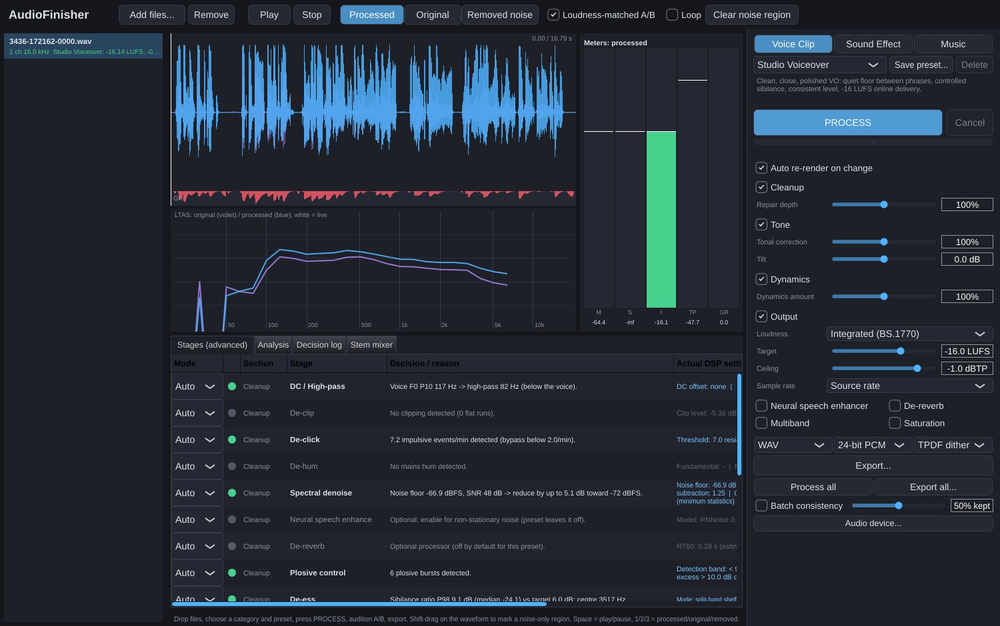

# AudioFinisher

One-click restoration, mixing and mastering for speech, sound effects and music.
A native C++ desktop application (JUCE GUI) with a self-contained DSP engine:
no plug-ins, no DAW, no cloud processing.

**Workflow:** drag in audio → choose *Voice Clip*, *Sound Effect* or *Music* →
choose a treatment preset → **PROCESS** → audition (latency-aligned,
loudness-matched A/B, or the removed noise alone) → **Export**.

Every render follows the same loop:

```
analyse source ─► select treatment ─► render ─► measure output ─► bounded corrections
     │                 │                                │
     │      presets = intent + limits         loudness / true peak / limiter GR /
     │      (not fixed chains)                denoise artifact checks, re-render
     └── loudness, true peak, crest, spectrum, noise profile, hum, clicks,
         clipping, speech activity, F0, sibilance, plosives, stereo, transients, RT60
```

Every decision (stage on or off, each derived setting, and the reason) appears in the
**Stages (advanced)** panel and in the **Decision log**.



More screenshots: [music mastering](docs/screenshots/music-warm.png),
[noisy-voice rescue with the analysis panel and original A/B](docs/screenshots/voice-rescue-analysis.png),
[stem mixer](docs/screenshots/stem-mixer.png). All were captured from the real app running
headless under Xvfb.

---

## Building

Requirements: CMake ≥ 3.22, a C++20 compiler, Git, and network access for the first
configure (dependencies are pinned and fetched by CMake; see
[`cmake/Dependencies.cmake`](cmake/Dependencies.cmake)).

### Windows x64 (primary target)

Visual Studio 2022 (Desktop C++ workload) or Build Tools 2022:

```bat
cmake -S . -B build -G "Visual Studio 17 2022" -A x64
cmake --build build --config Release --parallel
ctest --test-dir build -C Release --output-on-failure
```

Outputs (static CRT, so no VC++ redistributable is needed):

* `build\app\AudioFinisher_artefacts\Release\AudioFinisher.exe`: the desktop app
* `build\cli\af_cli_artefacts\Release\*.exe`: command-line renderer
* `build\tests\af_tests_artefacts\Release\*.exe`: DSP validation suite

**Prebuilt release:** the GitHub Actions workflow (green on `windows-2022`)
[`.github/workflows/build.yml`](.github/workflows/build.yml) builds on
`windows-2022` with MSVC, runs the validation suite, and uploads
`AudioFinisher-win64.zip` as a build artifact on every push. Pushing a tag `v*`
also attaches the zip to a GitHub Release.

### Linux (development / CI)

```sh
sudo apt-get install ninja-build libasound2-dev libx11-dev libxrandr-dev libxinerama-dev \
  libxcursor-dev libxext-dev libfontconfig1-dev libfreetype-dev libgl1-mesa-dev
cmake -S . -B build -G Ninja -DCMAKE_BUILD_TYPE=Release
cmake --build build && ctest --test-dir build --output-on-failure
```

CMake options: `AF_BUILD_GUI`, `AF_BUILD_CLI`, `AF_BUILD_TESTS` (all ON).
For offline builds, point `FETCHCONTENT_SOURCE_DIR_<NAME>` at local checkouts.

---

## Using the application

| Area | What it does |
|---|---|
| File list (left) | Drag & drop or **Add files...** (WAV, FLAC, AIFF, Ogg Vorbis, MP3). Originals are never modified or overwritten. |
| Category + preset (right) | 15 presets in three families; user presets (★) are saved with **Save preset...** |
| **PROCESS** | Analyses (cached per file and category) and renders on a background thread with progress and **Cancel**. With *Auto re-render* on, changing any control re-renders after a short pause. |
| Simple controls | **Cleanup** (repair depth), **Tone** (correction strength + tilt), **Dynamics** (amount), **Output** (loudness mode, target, true-peak ceiling, sample rate). Each section can be switched off. |
| Optional processors | Neural speech enhancer, de-reverb, multiband, saturation (or any stage via the advanced panel: Auto / On / Bypass). |
| Waveform | Original (violet) vs processed (blue), gain-reduction lane, click to seek, **Shift-drag to mark a noise-only region** for the noise profile. |
| Spectrum | Live analyser of what you hear plus the long-term spectra of original and processed. |
| Meters | Momentary, short-term and integrated LUFS, true peak (dBTP) and gain reduction at the playhead, with target and ceiling markers. |
| Transport / A/B | **Processed / Original / Removed noise** (keys 1/2/3, space = play). Switching keeps the playhead and crossfades over 20 ms. The *Loudness-matched* toggle attenuates whichever signal is louder, so neither one clips. |
| Stages (advanced) | Every stage: state, decision and reason, actual DSP settings, and a per-stage override. |
| Analysis / Decision log | The full source analysis, before/after measurements, every render pass and correction, and stage timings. |
| Stem mixer | Aligned stems with roles, gain, pan, bus routing, mute, per-stem treatment toggle, bus gain and glue; **MIX + MASTER** renders through the selected Music preset and the Output controls. |
| Export | WAV 16/24-bit PCM or 32-bit float, FLAC 16/24-bit, Ogg Vorbis (~256 kbps); TPDF or noise-shaped dither (engine-side, identical to preview). **Process all** and **Export all...** run batches, and **Batch consistency** aligns assets to the group target while keeping a set percentage of their intended differences. |

Command line (same engine): `AudioFinisher file.wav --category voice --preset voice.studio --process`
opens the GUI with the file loaded and processed.

### CLI renderer

```
af_cli presets
af_cli analyze in.wav --category voice
af_cli process in.wav out.wav --preset voice.studio --plan --removed removed.wav --reference matched_original.wav
af_cli process mix.wav master.flac --preset music.warm --lufs -12 --ceiling -1 --sr 44100 --bits 24 --format flac
af_cli batch outdir a.wav b.wav c.wav --preset sfx.game --consistency 0.5
```

`--plan` prints every stage decision, setting and correction. `--reference` writes the
loudness-matched, latency-aligned original for external A/B listening.

---

## Presets

| Family | Preset | Delivery default | Intent |
|---|---|---|---|
| Voice | Natural Dialogue | −23 LUFS / −2 dBTP | transparent, room continuity, gentle riding |
| | Studio Voiceover | −16 LUFS / −1 dBTP | clean, close, controlled sibilance, quiet floor |
| | Broadcast Presence | −23 LUFS / −1 dBTP | forward presence, multiband density |
| | Warm/Intimate | −18 LUFS / −1 dBTP | low-mid body, smooth top, tape-style saturation |
| | Noisy Recording Rescue | −18 LUFS / −1 dBTP | deep adaptive NR + neural enhancer, optional de-reverb |
| Sound Effect | Transparent Cleanup | peak −1 dBTP | repair only |
| | Punchy Impact | −14 LUFS max-momentary | transient emphasis, parallel compression |
| | Detailed Foley | −18 LUFS max-momentary | bounded downward expansion, resonance control |
| | Ambience Preservation | −26 LUFS integrated | defects only, minimal NR, LF air kept |
| | Game Asset Consistency | −16 LUFS max-momentary | uniform delivery, batch consistency |
| Music | Transparent Master | −14 LUFS / −1 dBTP | minimal broad correction |
| | Warm/Glue | −12 LUFS | bus glue, subtle saturation |
| | Punchy | −11 LUFS | transient-friendly compression |
| | Loud/Dense | −9 LUFS | multiband, soft saturation, bounded soft clipping, firmer limiting |
| | Dynamic/Open | −16 LUFS | preserves crest factor |

Each preset bounds automatic EQ boost and cut, noise attenuation, compressor and limiter
gain reduction, de-essing and plosive depth. Targets and ceilings can be edited. When a
loudness target can't be reached within the limiting bound, the result is delivered quieter
and the report says so.

---

## Implemented and verified capabilities

See [`docs/CAPABILITIES.md`](docs/CAPABILITIES.md) for the full list, with algorithms,
verification method and measured results, and [`docs/VALIDATION-REPORT.txt`](docs/VALIDATION-REPORT.txt)
for the raw output of the validation suite.

## Repository layout

```
engine/   pure C++20 DSP engine (no JUCE): analysis, processors, decision engine, renderer, stem mixer
io/       WAV/FLAC/AIFF I/O on JUCE codecs with engine-side dither
app/      JUCE desktop application
cli/      command-line renderer
tests/    DSP validation suite (self-contained, CTest)
docs/     capability list, validation report, listening-test procedure
```

Third-party licences: [`LICENSE-THIRD-PARTY.md`](LICENSE-THIRD-PARTY.md). JUCE is AGPLv3 or
commercial; check the terms before distributing binaries.
